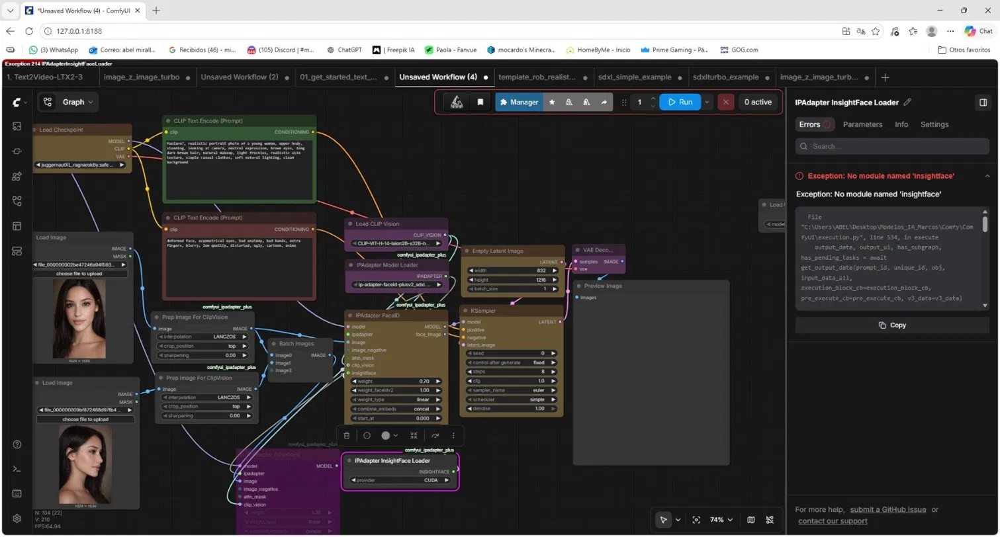
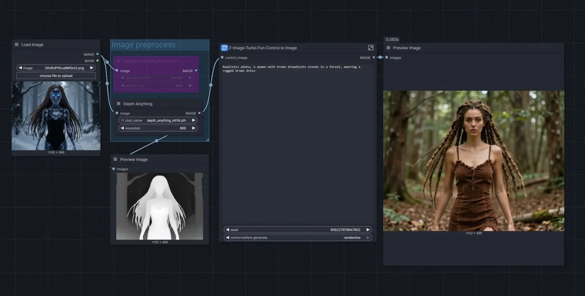
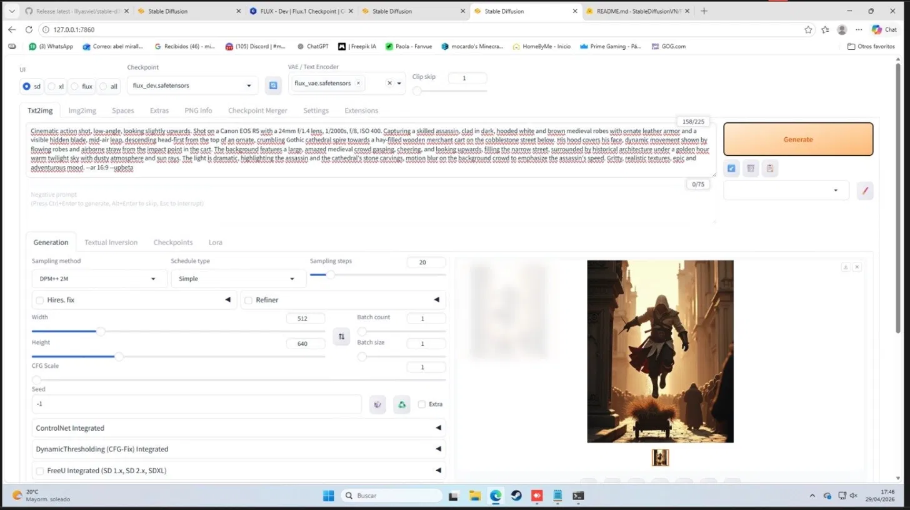
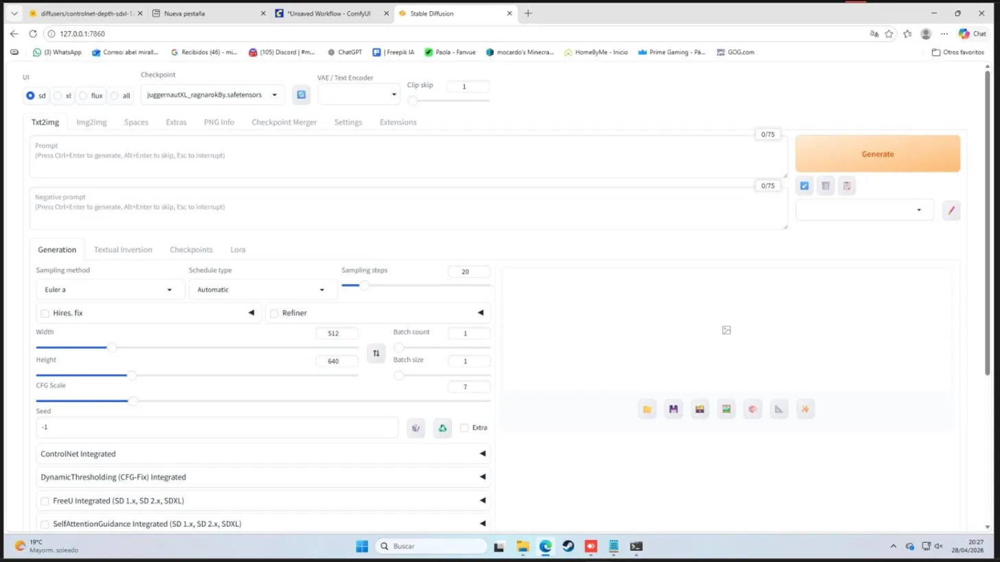

# 🎨 Entorno de IA Local de Alto Rendimiento

> Pipeline modular de generación de contenido visual fotorrealista con consistencia facial garantizada del **100%** — desarrollado para un creador de contenido de motor en Instagram.

---

## 📌 El problema

Un creador de contenido de motos y modelos en Instagram perdía días generando imágenes fotorrealistas con herramientas en la nube:
- ❌ Pérdida de identidad facial entre publicaciones
- ❌ Deformaciones en vehículos y detalles mecánicos
- ❌ Sin control sobre poses y vestuario
- ❌ Las herramientas cloud no ofrecían la precisión necesaria para mantener coherencia visual

---

## ✅ La solución

Configuré un **entorno local de alto rendimiento (RTX 5090)** y desarrollé dos sistemas de composición modular en **ComfyUI** y **Stable Diffusion** que automatizan la producción visual de principio a fin.

---

## 🏗️ Arquitectura del pipeline

```
Brief del creador (pose, vestuario, vehículo)
        │
        ▼
  ControlNet → fija pose exacta del piloto / orientación del vehículo
        │
        ▼
  IP-Adapter → mantiene consistencia del vestuario técnico
        │
        ▼
  Face-Swap + LoRAs → inyecta identidad facial idéntica en cada imagen
        │
        ▼
  Upscaler (4x-UltraSharp) → renderizado de alta fidelidad
        │
        ▼
  Contenido visual listo para publicar ✅
```

---

## 📈 Resultados

| Métrica | Antes | Después |
|---|---|---|
| Consistencia facial | Variable | **100% garantizada** |
| Deformaciones en vehículos | Frecuentes | Eliminadas |
| Control de pose | Ninguno | Total (ControlNet) |
| Tiempo de producción | Días | Horas |

---

## 🛠️ Stack tecnológico

| Tecnología | Rol |
|---|---|
| **ComfyUI** | Workflows modulares de generación |
| **Stable Diffusion (AUTOMATIC1111)** | Interfaz principal de generación |
| **ControlNet** | Control de pose y estructura (OpenPose, Depth, Canny) |
| **IP-Adapter** | Consistencia de vestuario e identidad visual |
| **Face-Swap** | Inyección de identidad facial |
| **LoRAs** | Modelos fine-tuned para estilos y personajes específicos |
| **Florence-2** | Etiquetado automático del dataset para entrenamiento |
| **AnimateDiff / Deforum** | Animación y vídeo |

---

## 🖥️ Entorno configurado

### Base
- Stable Diffusion con GPU activa (RTX 5090)
- AUTOMATIC1111 + ComfyUI

### Modelos
- Juggernaut XL
- RealVis XL
- SDXL base + refiner
- VAE (sdxl_vae)
- Upscalers: 4x-UltraSharp, ESRGAN

### ControlNet
- OpenPose — control de poses a partir de referencias
- Depth — control de profundidad y estructura
- Canny — control de bordes y geometría

### Vídeo / Animación
- AnimateDiff
- Deforum
- Text2Video con LTX2-3

---

## 🖼️ Resultados visuales

### ComfyUI — IPAdapter + Face Consistency


### ComfyUI — Depth ControlNet + Image2Image


### Text2Video LTX2-3


### Stable Diffusion — Generación fotorrealista



---

## 🧩 Workflows ComfyUI incluidos

- `text-to-image` — generación base
- `image-to-image` — transformación con referencia
- `ipadapter-face` — consistencia facial con IP-Adapter
- `depth-controlnet` — control estructural con Depth
- `text2video-ltx` — generación de vídeo con LTX2-3

---

## 🤖 Etiquetado automático de dataset con Florence-2

Para el entrenamiento de LoRAs específicos del cliente, automaticé el etiquetado del dataset completo con **Florence-2**, eliminando el proceso manual de descripción imagen por imagen.

---

## 📁 Estructura del repositorio

```
local-ai-image-pipeline/
├── workflows/
│   ├── text_to_image.json
│   ├── ipadapter_face.json
│   └── depth_controlnet.json
├── assets/
│   ├── comfyui_ipadapter.png
│   ├── comfyui_depth.png
│   ├── text2video.png
│   ├── stable_diffusion_1.png
│   └── stable_diffusion_2.png
├── docs/
│   └── setup.md
└── README.md
```

---

## ⚙️ Requisitos de hardware

- GPU: RTX 5090 (24GB VRAM recomendado para modelos XL)
- RAM: 32GB+
- Almacenamiento: 500GB+ (modelos ocupan ~100GB)

---

---

## 💬 Testimonio del cliente

> *"Ya va mejorando la cosa. Muchos errores que me saltaban los estoy arreglando yo. Después de una semana metiéndole 14 horitas te juro que hasta soñaba con los putos nodos. Pero bueno ya está dando sus frutos, así que bastante bien."*
> — Abel, creador de contenido de motor en Instagram

> *"Porfin estoy consiguiendo hacer imágenes consistentes, realistas y además sin restricciones. Justo lo que buscaba."*
> — Abel, tras implementar el pipeline con Flux

---

*Desarrollado para creador de contenido de motor en Instagram 🏍️*
